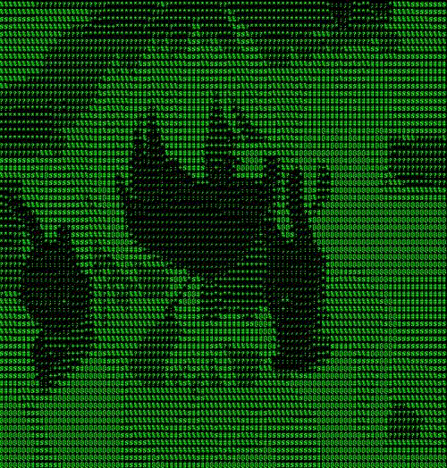

# Video2ASCIIgif

This CLI app takes in a mp4 format video, converts it to a gif with ASCII effect applied. This also includes full control over:
* background color
* foreground color
* detail picked up by the ASCII effect
* speedup or slowdown
* size of output file
Check [here](https://github.com/Roboramv2/video2ascii#examples) for examples.
***

## Usage:

1. clone into the repository using this in the command line terminal:
    
    git clone https://github.com/Roboramv2/video2ascii.git

2. take the video you want to convert to ASCII gif and put it into this directory

3. go into the directory in the command line and use this command:
    
    python video.py --fn filename --bg 255,255,255 --fg 0,0,0 --rd 1 --sp 3 --sz 0.4

4. the parameters are as follows:
    * --fn is name of the video file including extension (mp4 only)
    * --bg is background color in RGB values
    * --fg is foreground color in RGB values
    * --rd is detail reduction. 1 for no reduction, use 2, 3 etc for reduction
    * --sp is speed factor, takes float values with 1 for no speed change, higher for speedup, and lower for slowdown
    * --sz is size factor, takes float values between 0 and 1, not including 0

## Examples:
|Characteristic||||
|-|-|-|-|
|Original||||
|--rd 1, 2, 3||||
|--sp 2, 3, 4||||
|--sz 0.8, 0.6, 0.4||||
|memory used for sz|800KB|400KB|200KB|
|some colors using --bg and --fg||||
